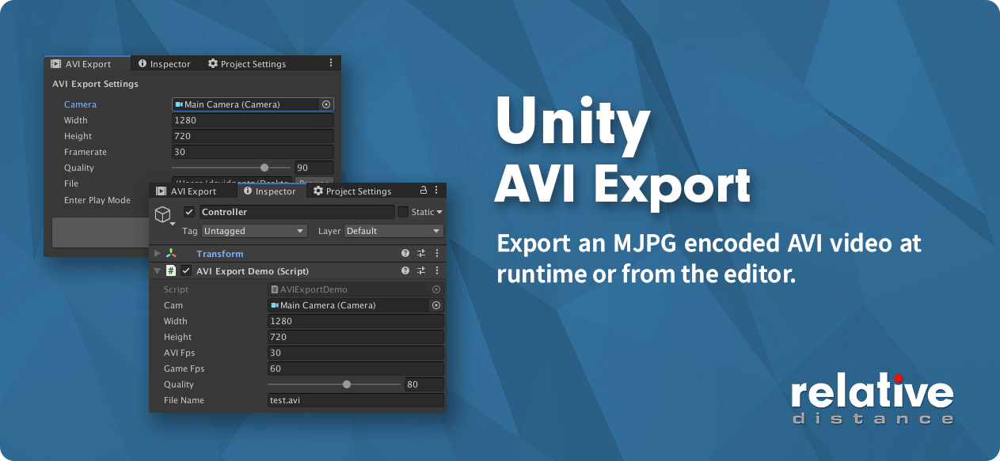

# Unity AVI Export

[**View WebGL Demo Scene**](https://relativedistance.github.io//UnityAVIExport/index)

Export an MJPG encoded AVI at runtime or from the editor.  It is a Unity wrapper around this code: [MotionJPEGWriter](https://github.com/secile/MotionJPEGWriter). The AVIs produced by this plugin will play natively on MacOS and Windows without any additional codecs. Plugin should work with all Unity platforms (only standalone and WebGL tested). 

# Installation
Import the [UnityAVIExport.unitypackage](https://github.com/RelativeDistance/UnityBackgroundBuild/raw/master/Assets/UnityAVIExport.unitypackage).  Then follow either the runtime or editor instructions below.

## Runtime Usage

Create a new instance:

```csharp
AVIExport avi = new AVIExport();
```

Then use the following methods:

### Initialize AVI

```csharp
avi.Init(camera,width,height,aviFps,gameFps,quality);
```
- **Camera** - Camera reference for AVI output, if null main camera will be used
- **Width/Height** - Dimensions of the AVI in pixels
- **AVIFps** - Framerate of AVI, decimals ok such as 29.97 NTSC
- **GameFPS** - The frame rate the project is currently running at on target platform.
- **Quality** - Integer between 0 (worst) - 100 (best) for jpg quality of each frame. 

### Frame Update
```csharp
avi.DoUpdate();
```
Call this every frame in Update, LateUpdate, etc.

### Start Recording

```csharp
avi.startRecording();
```

### Stop Recording

```csharp
avi.stopRecording();
```

### Get Byte Array

```csharp
avi.getByteArray();
```
Save the byte array to a file with something like this:
```csharp
File.WriteAllBytes("Video.avi" , avi.getByteArray());
```
See the included demo scene for an example.

## Editor Usage

Go to Window->AVI Export to open the editor window.

- **Camera** - Camera content for the AVI output, defaults to main camera
- **Width/Height** - Dimensions of the AVI in pixels
- **AVIFps** - Framerate of AVI, decimals ok such as 29.97 NTSC
- **Quality** - Integer between 0 (worst) - 100 (best) for jpg quality of each frame. 


## TODO
- Currently video only, add audio
- Improve performance with AsyncGPUReadback (something like 10-20% increase expected)
- Look into WebGL 2 Render Texture bug and see if there's a workaround
